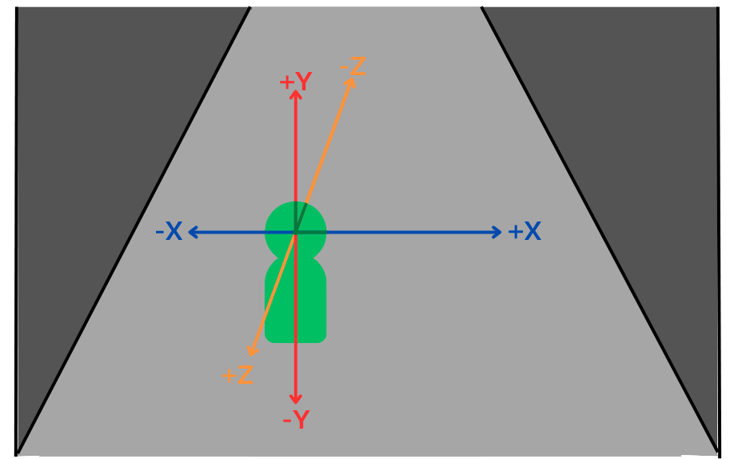

### Understanding Player Geometry in Mirador

In Mirador, the player's position, orientation, and movement are defined by three main properties: `position`, `pitch`, and `yaw`. These determine where the player is in the world, which direction they're looking, and how they move across the maze.

The `position` is a three-element array—`[f32; 3]`—representing the player's location in a 3D Cartesian coordinate system. The first element corresponds to the X-axis (left/right), the second to the Y-axis (up/down), and the third to the Z-axis (forward/backward). In Mirador, the origin `(0, 0, 0)` acts as a fixed world point, and the `position` tracks the player’s displacement from that origin.

The `pitch` represents the player's vertical gaze—how far up or down they're looking—and is the rotation around the local X-axis (to the player's right). A higher pitch means the player is looking up, and a lower pitch means they're looking down. It is measured in degrees and is clamped between -89.0 and 89.0 to avoid disorienting effects such as the view flipping upside down.

In contrast, the `yaw` governs the horizontal gaze and is the rotation around the local Y-axis (the vertical axis). It dictates whether the player is looking left, right, or spinning in a full circle. Unlike pitch, `yaw` is not clamped, since the player can rotate infinitely around the Y-axis without logical issues. A `yaw` of 0.0 corresponds to facing forward along the negative Z-axis, while 90.0 would align the player with the positive X-axis. Mirador initializes the player with a yaw of `316.0`, which is roughly -44 degrees, orienting the player diagonally toward the positive X and Z axes. This is later overridden by the spawn logic to face the maze’s northern entrance.

Although `position` is not explicitly bounded in the player struct, movement is implicitly constrained by maze geometry and collision detection. The player cannot move through walls or outside the defined boundaries of the world.

Pitch and yaw serve as the foundation for movement logic, particularly in how Mirador converts angles into direction vectors. Trigonometric functions like `sin` and `cos` appear in movement functions to derive the X and Z components of directional vectors. These functions translate an angle into movement along the axes based on unit circle principles. For instance, when moving forward, the game calculates the direction vector using `forward_x = sin(yaw)` and `forward_z = cos(yaw)`. This means if the yaw is 0 degrees, the player moves straight along the negative Z-axis—`sin(0)` is 0 and `cos(0)` is 1, so Z decreases and X stays the same.

Strafing left and right works by computing a right vector that is perpendicular to the forward vector. The logic uses `right_x = cos(yaw)` and `right_z = sin(yaw)` to determine lateral movement. When the player presses left, Mirador subtracts these values from the position to move leftward, and adds them when moving right.

Notably, pitch does not influence ground-based movement. Even though the player may be looking up or down, the actual movement direction remains level—along the XZ plane—since Mirador confines motion to a 2D ground surface. This is standard in many first-person games where jumping and flying are either not supported or handled separately.

The game's coordinate system aligns with common 3D conventions. The Y-axis represents vertical height, with positive Y being up. The Z-axis points forward and backward, where movement along negative Z is considered "forward." The X-axis spans left to right, with positive X being to the right of the player. This system aligns with typical right-handed OpenGL-style coordinate systems.

The `sin` and `cos` functions handle arbitrary yaw values seamlessly, even beyond 360 degrees, making them ideal for continuous player rotation. For instance, a yaw of 720 degrees is effectively the same as 0 degrees. This natural cyclic behavior means Mirador doesn’t need to clamp or normalize yaw during gameplay.

In summary, the player's x axis runs from left to right, the y axis runs from bottom to top, and the z axis runs from front to back (objects in the distance from the players perspective have a negative z). Yaw determines horizontal rotation and is unbounded, pitch is clamped to maintain vertical stability. Player movement is accomplished by using sin and cos to translate the yaw rotation into a direction vector.
